# starship-theme

Minimal [Starship](https://starship.rs) prompt themes built from **rounded solid chips** —
no powerline arrows, no clutter. Path, git branch and language, and nothing else competing
for your attention.

> **Requires a [Nerd Font](https://www.nerdfonts.com/)** — the rounded caps use
> `U+E0B6` / `U+E0B4`. Tested with JetBrainsMono Nerd Font Mono.

---

## Themes

### midnight-bloom
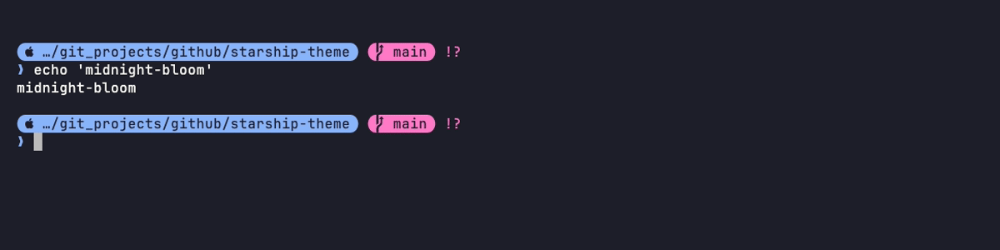

### dracula-classic
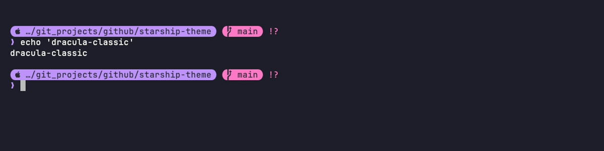

### catppuccin-mocha
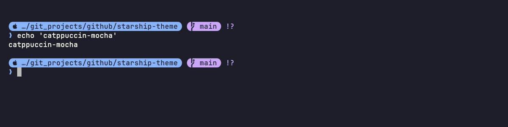

### catppuccin-macchiato
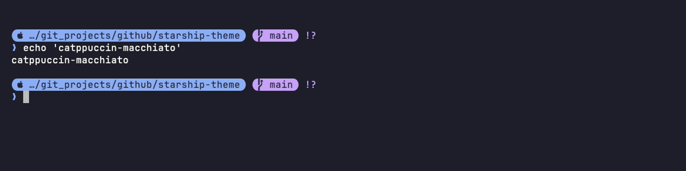

### cyber-tokyo
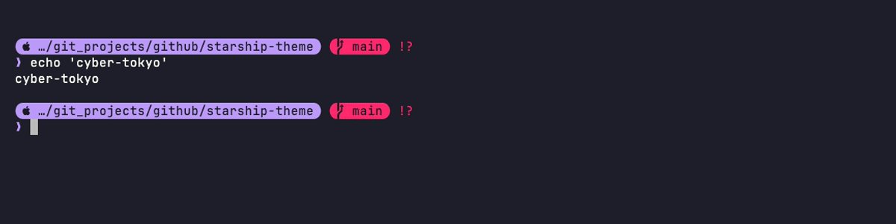

### tokyo-night-minimal


### tokyo-night-neo
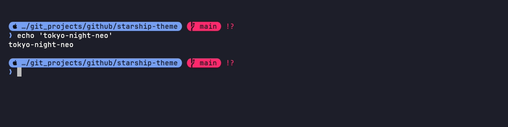

### material-ocean
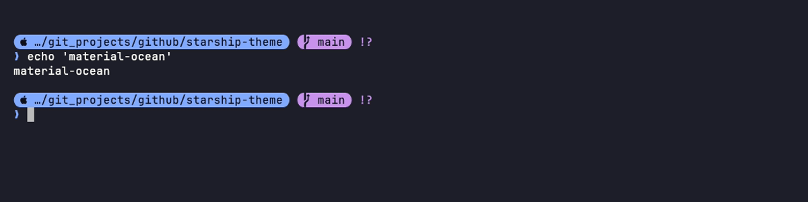

### nord-frost
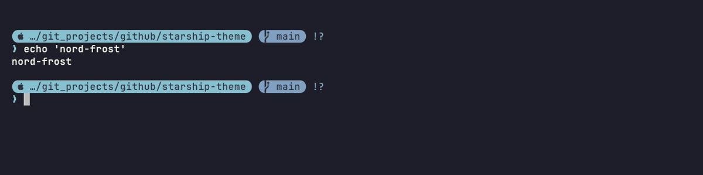

### vaporwave
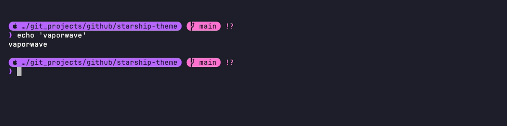

### gruvbox-ember
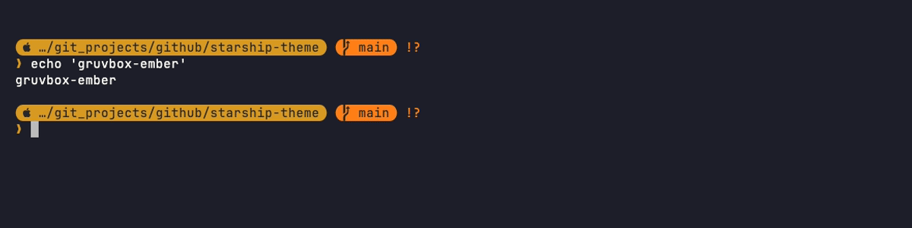

### arch-os
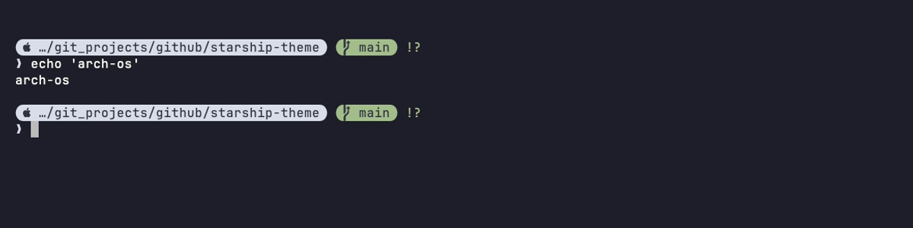

### ccswe-dark
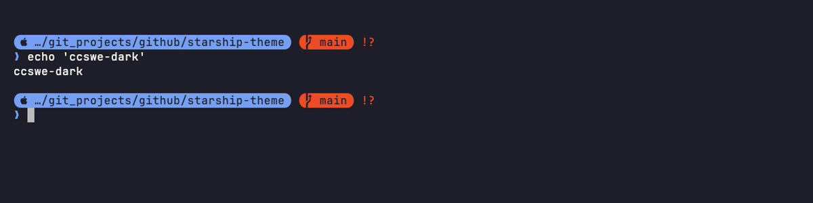

### ninetailedstarship-latte
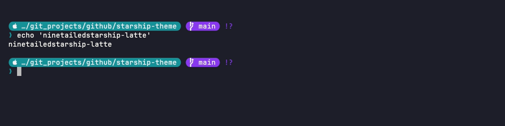

### ninetailedstarship-frappe
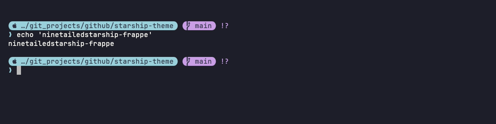

### ninetailedstarship-macchiato
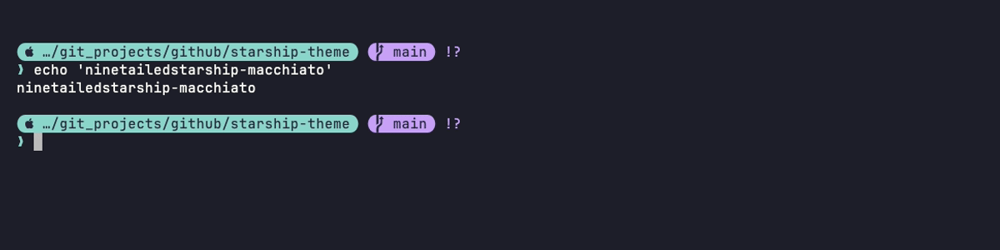

### ninetailedstarship-mocha
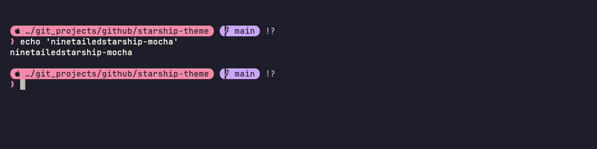

---

## Prompt layout

```
 󰀵 …/github/starship-theme   main ?1   🐍 v3.12.1   1.2s
❯
```

Path, git branch/status, active language version, command duration. Each segment is a
rounded chip that disappears cleanly when not needed — no phantom separators.

---

## Install

```bash
git clone https://github.com/Aviksaikat/starship-theme.git
cd starship-theme
./install.sh
```

Symlinks every `themes/*.toml` into `~/.config/starship/`. Re-running is safe — existing
links are reported, real files are never overwritten. To undo:

```bash
./install.sh --uninstall
```

---

## Random rotation

**zsh** — add to `~/.zshrc` before `eval "$(starship init zsh)"`:
```zsh
_themes=()
for f in "$HOME/.config/starship"/*.toml; do
  [[ "$f" == *jetpack.toml ]] && continue
  [[ -r "$f" ]] && _themes+=("$f")
done
(( ${#_themes} > 0 )) && export STARSHIP_CONFIG="${_themes[RANDOM % ${#_themes} + 1]}"
```

**fish** — add to `~/.config/fish/config.fish` before `starship init fish | source`:
```fish
set -l _starship_themes
for f in $HOME/.config/starship/*.toml
    string match -q '*jetpack.toml' $f; and continue
    test -r $f; and set -a _starship_themes $f
end
test (count $_starship_themes) -gt 0
    and set -gx STARSHIP_CONFIG (random choice $_starship_themes)
```

---

## Preview all themes locally

```bash
bash tools/preview.sh
```

Cycles through every theme live in your current shell. Press Enter to advance, Ctrl-C to stop.

---

## Development

```bash
python3 tools/generate.py    # regenerate themes/ from the template
python3 tools/verify.py      # assert every theme renders styled pills
bash tools/gen_tapes.sh      # re-record all media/png screenshots via VHS
```

---

## Structure

```
starship-theme/
├── themes/          # 17 .toml themes
├── media/png/       # VHS screenshots (one per theme)
├── tapes/           # VHS tape files used to generate screenshots
├── tools/
│   ├── generate.py
│   ├── verify.py
│   ├── render_html.py
│   ├── gen_tapes.sh
│   └── preview.sh
├── docs/
├── install.sh
└── README.md
```
