# starship-theme

Two families of [Starship](https://starship.rs) prompt themes:

- **Rounded-chip** — minimal solid chips. Path, git branch, language. No clutter.
- **Powerline** — full segments with os / user / path / git / langs / time, recoloured into
  many palettes.

> **Requires a [Nerd Font](https://www.nerdfonts.com/)** — rounded caps use
> `U+E0B6` / `U+E0B4`, powerline arrows use `U+E0B0` / `U+E0B2`.
> Tested with JetBrainsMono Nerd Font Mono.

---

# Part 1 — Rounded-chip themes

## midnight-bloom
_Dracula-adjacent, soft violet_


## dracula-classic
_The canonical Dracula palette_


## catppuccin-mocha
_Catppuccin Mocha_


## catppuccin-macchiato
_Catppuccin Macchiato_


## cyber-tokyo
_Neon magenta on near-black_


## tokyo-night-minimal
_Tokyo Night, stripped back_


## tokyo-night-neo
_Tokyo Night with neon accents_


## material-ocean
_Material Ocean deep blue_


## nord-frost
_Nord Frost arctic blue_


## vaporwave
_Pink/cyan 80s retro_


## gruvbox-ember
_Gruvbox warm amber_


## arch-os
_Arch Linux signature blue_


## ccswe-dark
_CCSWE red on charcoal_


## ninetailedstarship-latte
_Catppuccin Latte, light bg_


## ninetailedstarship-frappe
_Catppuccin Frappe_


## ninetailedstarship-macchiato
_Catppuccin Macchiato variant_


## ninetailedstarship-mocha
_Catppuccin Mocha variant_


## saffron-grove
_Spice-market warmth, powerline arrows_

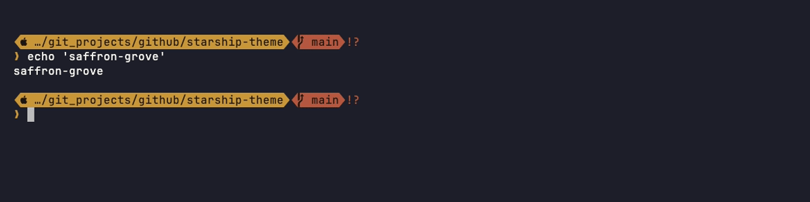

```
 󰀵 …/github/starship-theme   main ?1   🐍 v3.12.1   1.2s
❯
```

---

# Part 2 — Powerline variations

Recoloured clones of the p10k / pastel-powerline / catppuccin / gruvbox-rainbow
layouts (`tools/generate_variations.py`). Each keeps the original's full segment
chain — os, user, path, git, languages, time — and swaps only the palette.

## pl10k-*

p10k-style layout: os icon, user, path, git, languages, time, shell.

| | |
|---|---|
| **pl10k-nord** | 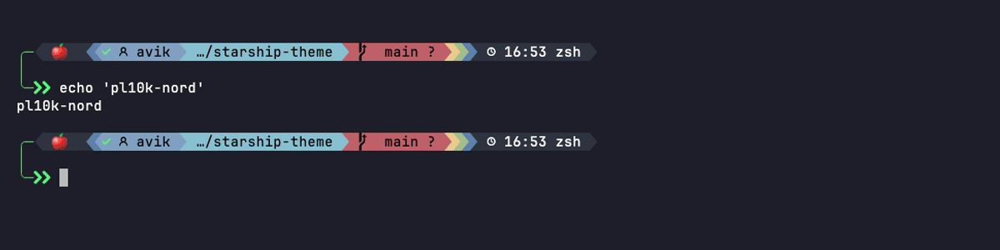 |
| **pl10k-dracula** | 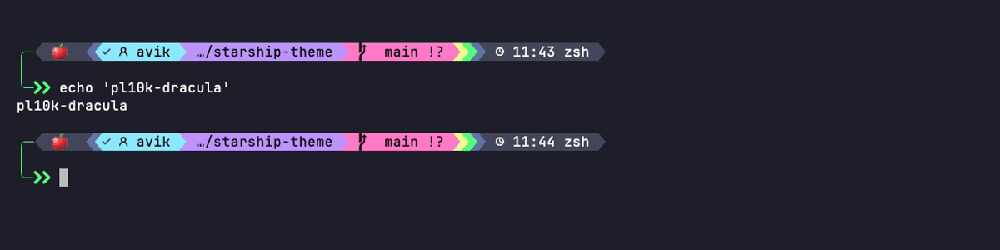 |
| **pl10k-tokyo** | 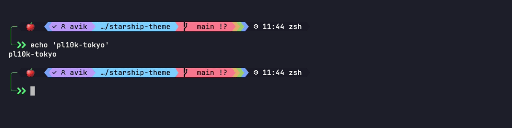 |
| **pl10k-catppuccin** |  |
| **pl10k-gruvbox** | 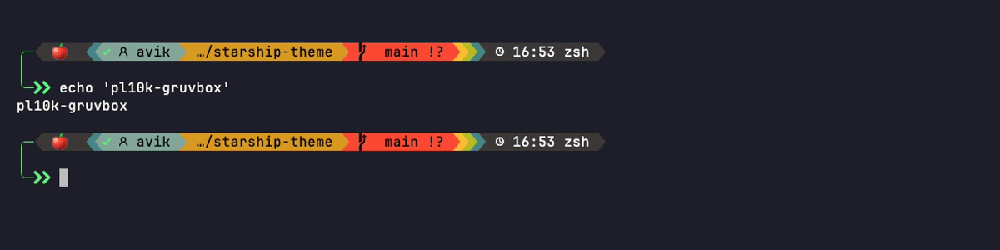 |
| **pl10k-rosepine** | 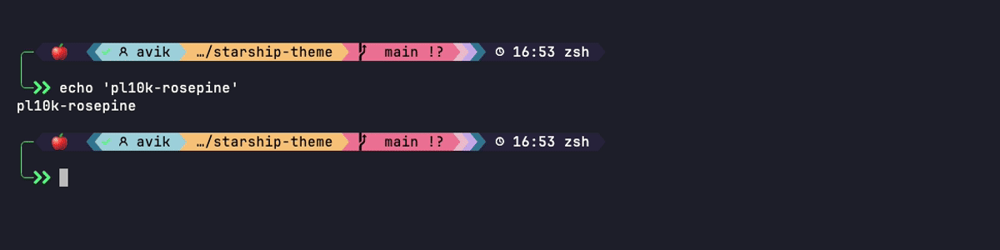 |

## pastel-*

Powerline layout: user, path, git, languages, docker, time.

| | |
|---|---|
| **pastel-nord** | 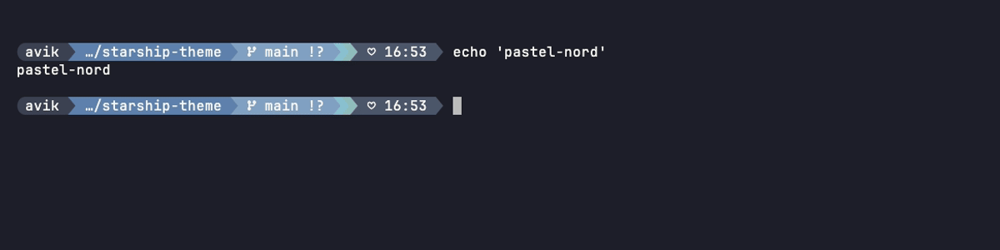 |
| **pastel-dracula** | 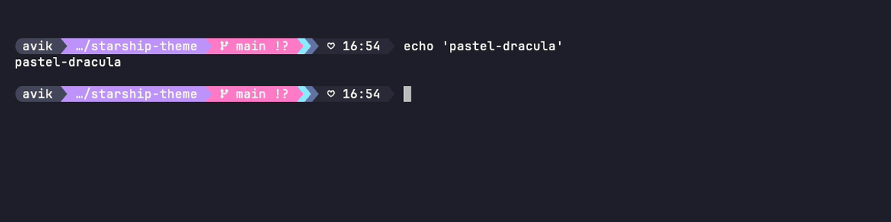 |
| **pastel-tokyo** | 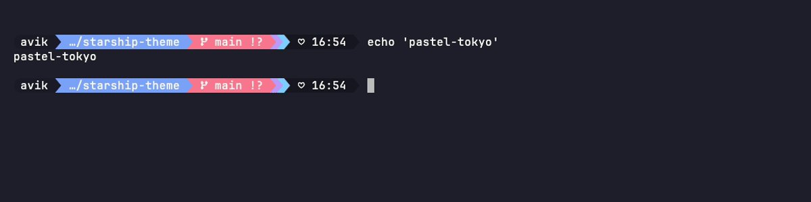 |
| **pastel-catppuccin** | 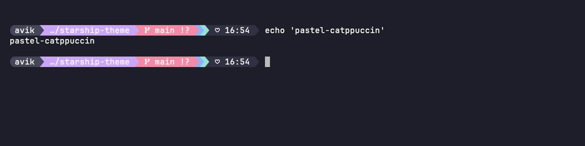 |
| **pastel-gruvbox** | 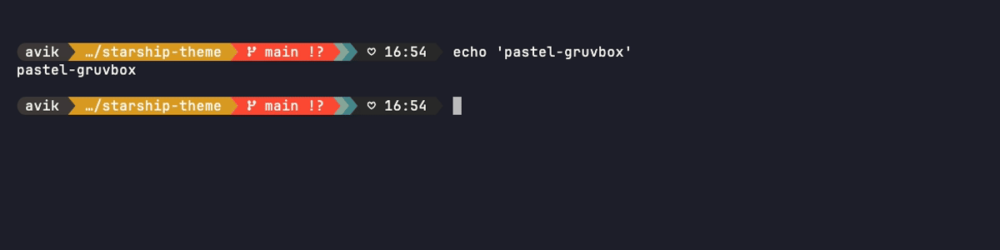 |
| **pastel-everforest** | 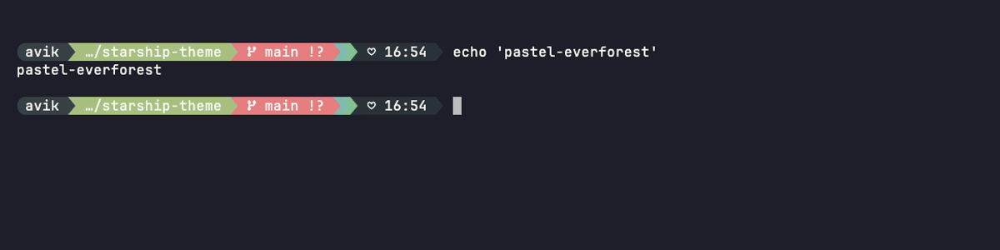 |

## catppuccin-*

Catppuccin layout: os, user, path, git, languages, conda, time, cmd duration.

| | |
|---|---|
| **catppuccin-nord** | 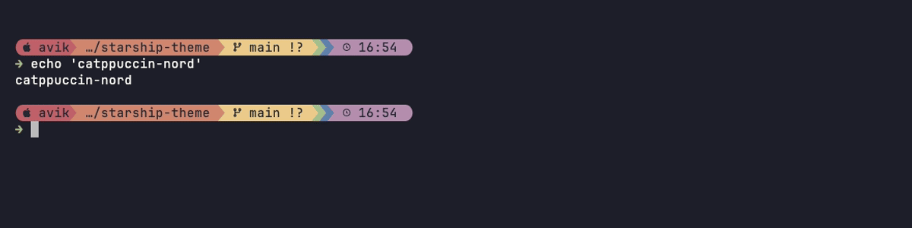 |
| **catppuccin-tokyo** |  |
| **catppuccin-rosepine** | 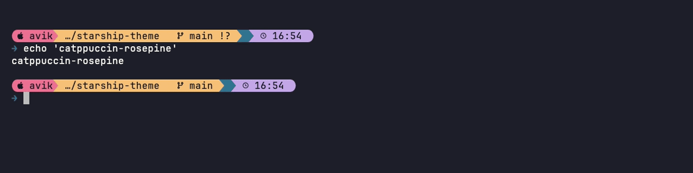 |
| **catppuccin-everforest** | 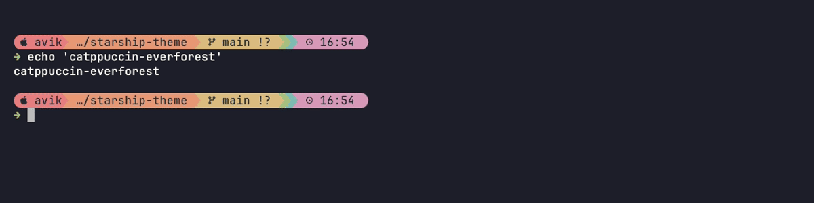 |
| **catppuccin-ocean** | 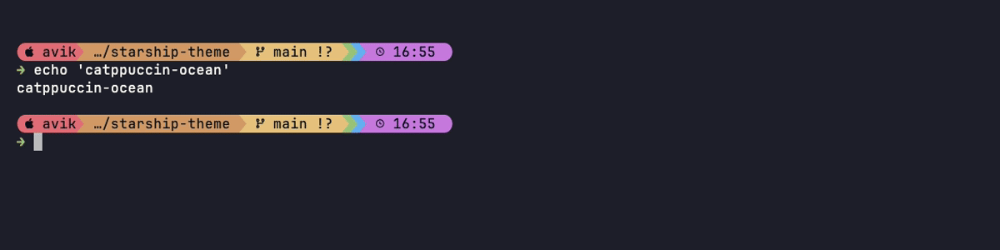 |
| **catppuccin-lavender** | 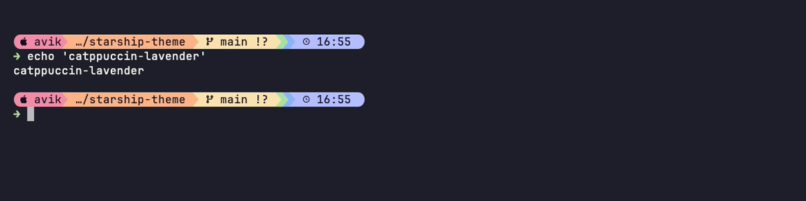 |

## gruvbox-*

Gruvbox-rainbow layout: os, user, path, git, languages, docker/conda, time.

| | |
|---|---|
| **gruvbox-light** | 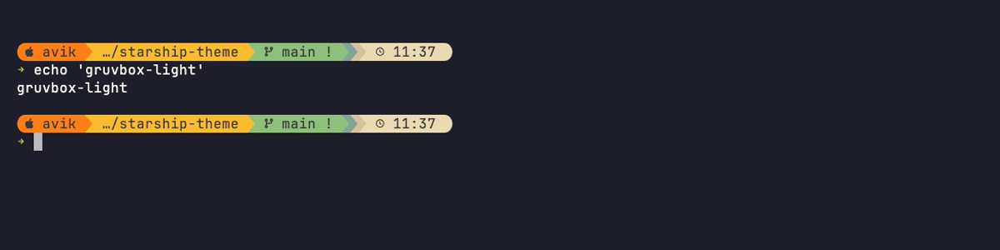 |
| **gruvbox-ocean** | 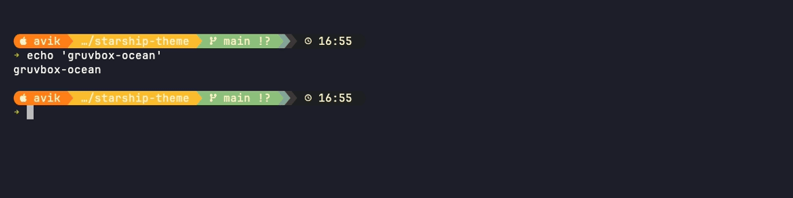 |
| **gruvbox-forest** | 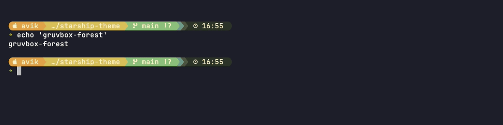 |
| **gruvbox-mono** | 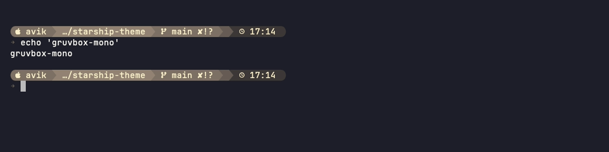 |

---

# Part 3 — Flat prompt variations

Christian Lempa-inspired flat prompts: OS icon, username, directory, detailed
git status, detected language, and command duration. Same layout, different
palettes.

| Theme | Preview |
|---|---|
| **christian-lempa** | 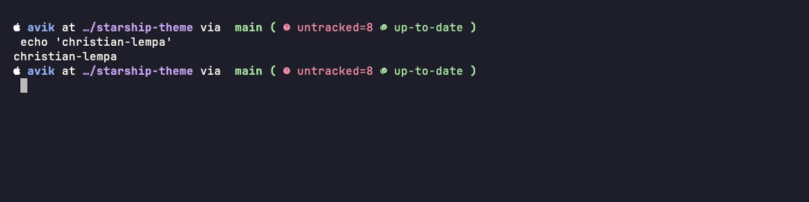 |
| **christian-tokyo-night** | 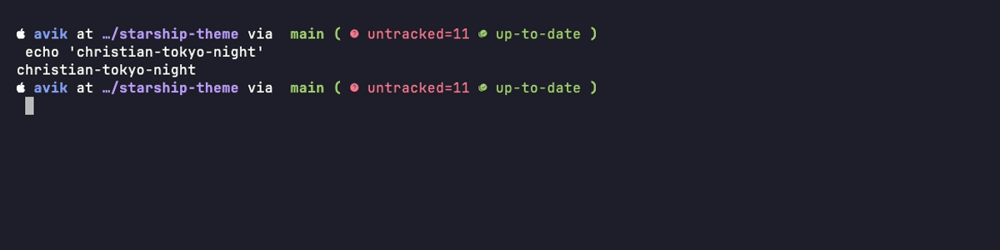 |
| **christian-nord** | 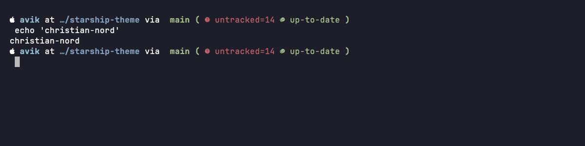 |
| **christian-gruvbox** | 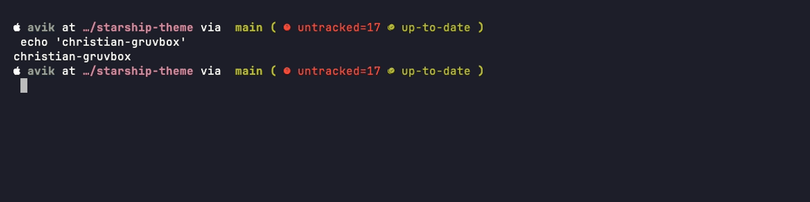 |
| **christian-rosepine** | 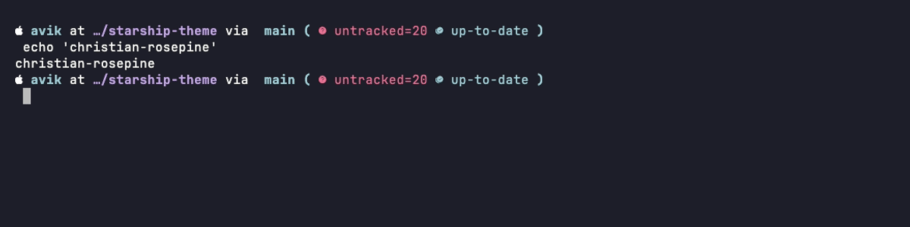 |
| **christian-everforest** | 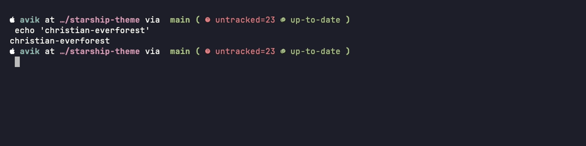 |
| **russ-gruvbox** | 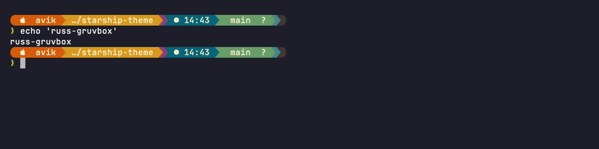 |

---

## Install

```bash
git clone https://github.com/Aviksaikat/starship-themes.git
cd starship-themes
./install.sh
```

Symlinks every `themes/*.toml` into `~/.config/starship/`. Re-running is safe — existing
links are reported, real files are never overwritten. To undo:

```bash
./install.sh --uninstall
```

---

## Random rotation

**zsh** — add to `~/.zshrc` before `eval "$(starship init zsh)"`:
```zsh
_themes=()
for f in "$HOME/.config/starship"/*.toml; do
  [[ "$f" == *jetpack.toml ]] && continue
  [[ -r "$f" ]] && _themes+=("$f")
done
(( ${#_themes} > 0 )) && export STARSHIP_CONFIG="${_themes[RANDOM % ${#_themes} + 1]}"
```

**fish** — add to `~/.config/fish/config.fish` before `starship init fish | source`:
```fish
set -l _starship_themes
for f in $HOME/.config/starship/*.toml
    string match -q '*jetpack.toml' $f; and continue
    test -r $f; and set -a _starship_themes $f
end
test (count $_starship_themes) -gt 0
    and set -gx STARSHIP_CONFIG (random choice $_starship_themes)
```

---

## Preview all themes locally

```zsh
zsh tools/preview.sh              # step through all themes (Enter = next, q = quit)
zsh tools/preview.sh --all        # dump every theme at once
zsh tools/preview.sh nord-frost   # just one
```

Must run under **zsh** — it uses `print -P` to render the ANSI escapes Starship emits.
Run it in a Nerd Font terminal (kitty, Ghostty, …).

---

## Development

```bash
python3 tools/generate.py              # regenerate the rounded-chip themes
python3 tools/generate_variations.py   # regenerate the powerline variations
python3 tools/verify.py                # assert rounded-chip themes render styled pills
python3 tools/verify_palette.py        # assert every palette colour reaches the output
python3 tools/verify_contrast.py       # assert chip text is legible (WCAG >= 3:1)
bash tools/gen_tapes.sh <name>         # re-record one screenshot via VHS
bash tools/gen_tapes.sh                # re-record all
```

Two checks exist because the obvious one is not enough:

- `verify_palette.py` — Starship **exits 0 and silently strips styling** when a
  `palette =` key fails to resolve, so an exit-code check proves nothing. This
  asserts the real truecolor escapes reach stdout, and (for the variations)
  that the *new* colour is present while the *source* colour is gone, so a
  silent fallback to the original palette can't pass.
- `verify_contrast.py` — rendering a colour is not the same as being able to
  read text on it. Every `fg:X bg:Y` pair is resolved and measured; glyph-only
  groups (the powerline arrows) are exempt because they are intentionally
  low-contrast shapes. `generate_variations.py` runs the same maths and
  auto-nudges accents so a variant cannot ship unreadable chips.

---

## Structure

```
starship-theme/
├── themes/          # 48 .toml themes
├── media/png/       # VHS screenshots (one per theme)
├── tapes/           # VHS tape files used to generate screenshots
├── tools/
│   ├── generate.py               # rounded-chip generator
│   ├── generate_variations.py    # powerline variation generator
│   ├── verify.py                 # chip-structure assertions
│   ├── verify_palette.py         # palette-resolution assertions
│   ├── verify_contrast.py        # chip-legibility assertions
│   ├── render_html.py
│   ├── gen_tapes.sh
│   └── preview.sh
├── docs/
├── install.sh
└── README.md
```
